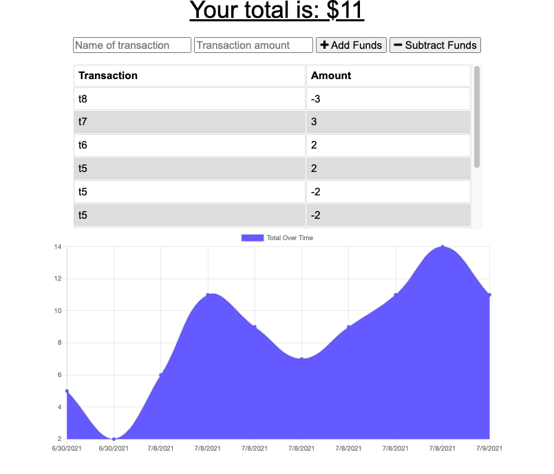

# budget_app

## Description
the purpose of this assignment is to add functionality to our existing Budget Tracker application to allow for offline access and functionality. The user will be able to add expenses and deposits to their budget with or without a connection. When entering transactions offline, they should populate the total when brought back online.

link to github repo:
https://github.com/jcorcorangithub/budget_app

link to application:

## Technologies
JavaScript
HTMl
CSS
Node.js
Express.js
MongoDb

## Contributors
I will be the sole contributor of this project 

## Contact
Name: James Corcoran 
email: jpcsoccer1234@gmail.com

